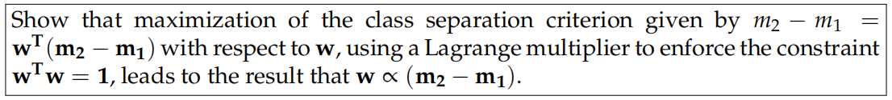
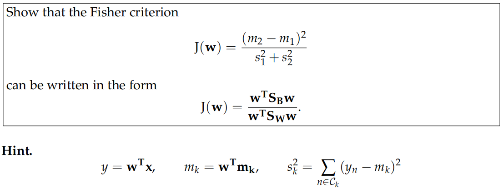
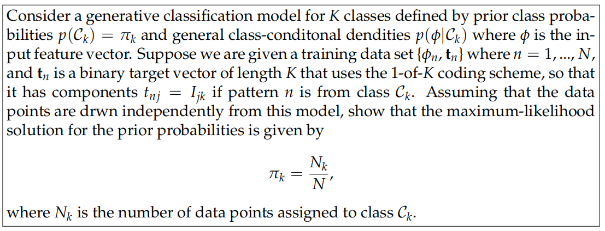
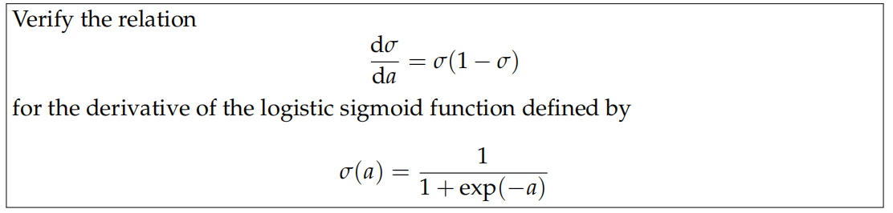
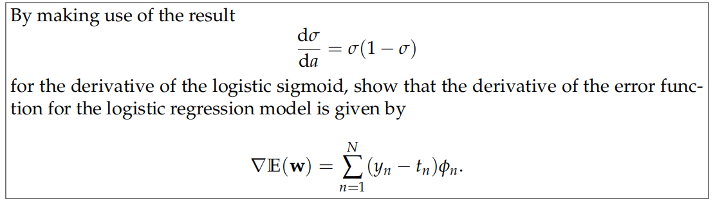
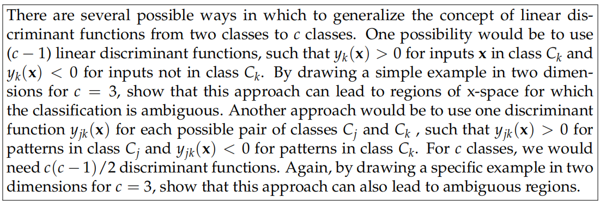
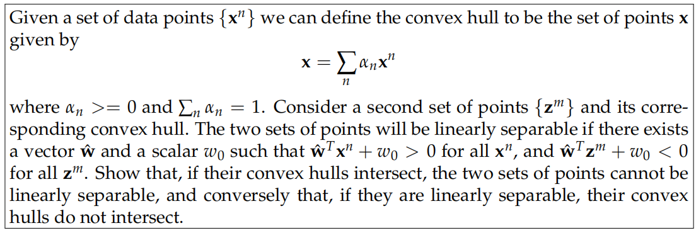

# Machine Learning Homework 4: Linear Models for Classification

> 叶璨铭， 12011404@mail.sustech.edu.cn

## Discriminant Function: Maximum Class Separation

> 

$$
\mathop{\mathbf{max}}_{w} f(w) = w^T{(\mathbf{m_2}-\mathbf{m_1})}\\
s.t. w^Tw = 1
$$

Using Lagrange Multiplier $\lambda$, we can transform the problem to be unconstrained. 
$$
\nabla f(w) = \lambda \nabla g(w) \\
g(w) = w^Tw-1 \\
g(w) = 0
$$
Since $\nabla f(w) = (\mathbf{m_2}-\mathbf{m_1})^T$ and $\nabla g(w) = 2w^T$, we obtain 
$$
w = \frac{1}{2\lambda}(\mathbf{m_2}-\mathbf{m_1}) \sim (\mathbf{m_2}-\mathbf{m_1})
$$

## Discriminant Function: Fisher Criterion

> 

## Generative Classification Model

> 

## Discriminative Classification Model

> 

## Discriminative Classification Model

> 

## Multi-Class  

> 

## Convex Hull

> 

