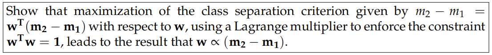
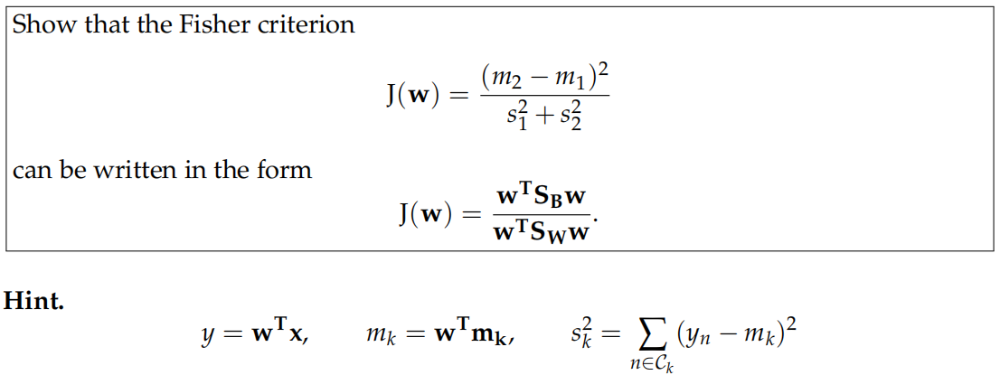
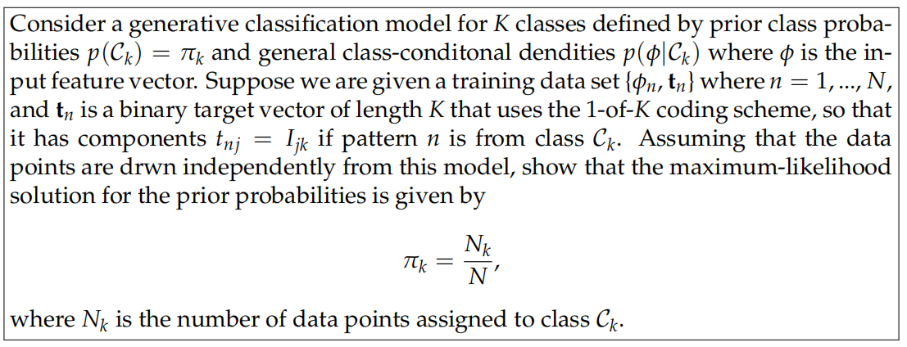
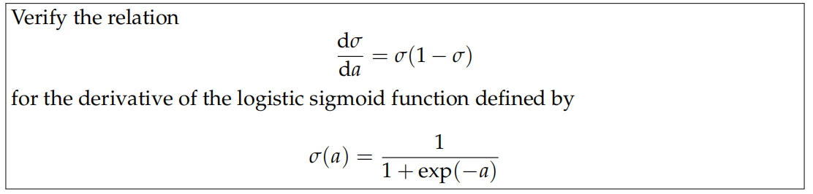
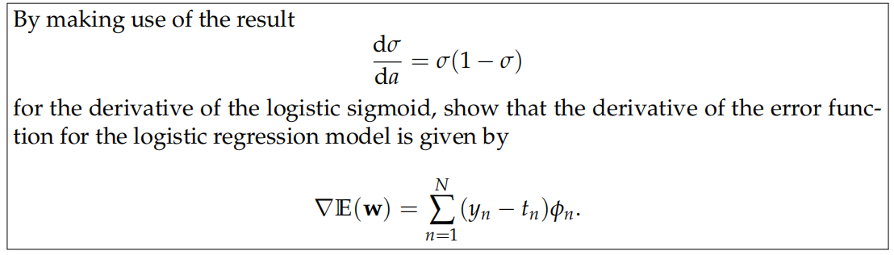
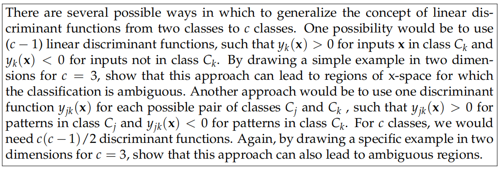
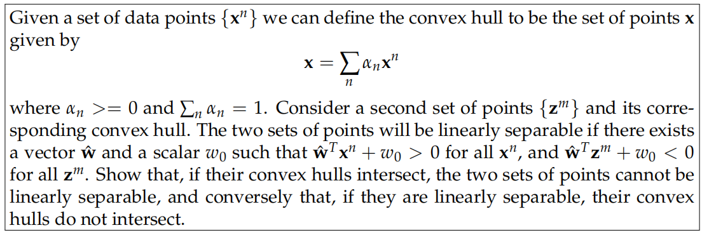

# Machine Learning Homework 4: Linear Models for Classification

> 叶璨铭， 12011404@mail.sustech.edu.cn

## Discriminant Function: Maximum Class Separation

> 

**Important Note:** 

- The notation is extremely unfriendly for handwritten homeworks. We should **never** distinguish two entirely different symbols merely by their boldness. 

- Therefore,  in this paper we shall use $\mu $ for the **before-projection mean**, while using m to denote the **after-projection mean**. As for variance, we use $\sum$ to denote the before and $S$ to denote the after. 
- We advocate that does not indicate anything, in case anyone may write it or read it wrong. 

**Solution:** The problem of the maximization of the class separation can be formulated as follows: 
$$
\mathop{\mathbf{max}}_{w} f(w) = w^T{(\mu_2-\mu_1)}\\
s.t. w^Tw = 1
$$

Using Lagrange Multiplier $\lambda$, we can transform the problem to an unconstrained one. 
$$
\nabla f(w) = \lambda \nabla g(w) \\
g(w) = w^Tw-1 \\
g(w) = 0
$$
Since $\nabla f(w) = (\mathbf{\mu_2}-\mathbf{\mu_1})^T$ and $\nabla g(w) = 2w^T$, we obtain 
$$
w = \frac{1}{2\lambda}(\mathbf{\mu_2}-\mathbf{\mu_1}) \sim (\mathbf{\mu_2}-\mathbf{\mu_1})
$$

## Discriminant Function: Fisher Criterion

> 

**Analysis: ** 

- $m_1$, $m_2$, $S_1$, $S_2$ are the mean and variance after the projection. The lower case $s_1$ and $s_2$ denotes the standard deviation. 
- $S_B$ and $S_W$ are "scatter matrix", which means how different the vectors are in the vector space.
- The B in $S_B$ denotes "between-class", and W in $S_W$ denotes "within-class". 

$$
S_B = \sum_{i=1}^{k-1}\sum_{j=i+1}^{k}(\mathbf{\mu_i-\mu_j})(\mathbf{\mu_i-\mu_j})^T\\
S_W =\sum_{i=1}^{k}\Sigma_k
$$

**Solution:** 
$$
J(\mathbf{w}) = \frac{(m_2-m_1)^2}{s_1^2+s_2^2} =  \frac{(\mathbf{w^T(\mu_2-\mu_1)})^2}{\mathbf{w^T \Sigma_1w+w^T \Sigma_2w}} = \frac{w^T(\mu_2-\mu_1)(\mu_2-\mu_1)^Tw}{w^T(\Sigma_1 + \Sigma_2)w} = \frac{w^TS_Bw}{w^TS_Ww}
$$

which is also refereed to as the generalized Rayleigh quotient.  

## Generative Classification Model

> 

**Analysis.** 

**Solution.** 
$$
-\ln P(D|\pi_k) = -\sum_{n=1}^{N}\ln P(\phi | C_k) + \ln P(C_k|\pi_k) \\
\nabla_{\pi_k}-lnP(D|\pi_k) =  -\sum_{n=1}^{N}(\ln P(C_k|\pi_k))^` = -\sum_{n=1}^{N} \pi_k^{-1} = -\sum_{k=1}^{K}\frac{N_k}{\pi_k}
$$

## Discriminative Classification Model

> 

**Solution.** 
$$
\frac{d\sigma(a)}{da} = -\sigma(a)^{-2} \frac{d(1+\exp(-a))}{da} \\
\frac{d(1+\exp(-a))}{da}  = \frac{d(\exp(-a))}{da}  = -\exp(-a) = -\frac{1}{exp(a)}
$$
and we know that 
$$
\sigma(a) =\frac{1}{1+\exp(-a)} = \frac{\exp(a)}{\exp(a)+1} = 1-\frac{1}{exp(a)+1}
$$
So
$$
\frac{d(1+\exp(-a))}{da} = \sigma^3(1-\sigma)
$$

## Discriminative Classification Model

> 

## Multi-Class  

> 

## Convex Hull

> 

## Glossary

- scatter
  - [ *VN*] ~ sth (on/over/around sth)~ sth (with sth)to throw or drop things in different directions so that they cover an area of ground 撒；撒播
  - [sing.] 散点，散落的样子。
- overstriking
  - 加粗

- bold
  - 加粗、勇敢。

## References

