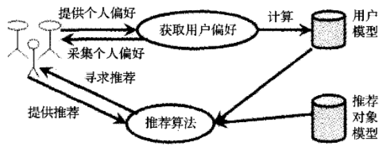
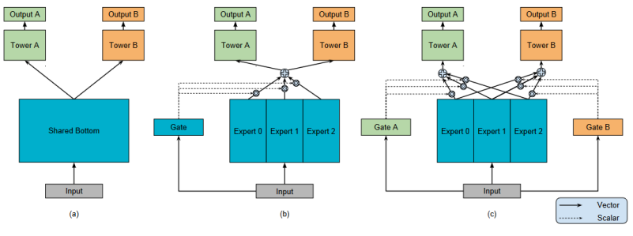

# 什么是多任务推荐系统？

12011404，叶璨铭

## 什么是推荐系统？

信息时代是信息产生价值的时代，互联网的普及满足了用户在信息时代对信息的需求，但也使得用户面对大量信息时无法找到对自己有用的信息，降低了对信息的使用效率，造成了信息超载(Information Overload)问题。为了解决这个问题，计算机科学家们提出了搜索引擎为代表的的信息检索系统和个性化推荐系统(Personalized Recommendation System)。[^1] 搜索引擎可以满足用户的主动需求，然而当用户没有明确搜索需求时，搜索引擎则无法有效向用户进行输出。而推荐系统作为一种主动的信息过滤系统，可以挖掘用户的搜索信息并满足用户的潜在需求，因而可以有效地辅助用户决策，为用户解决信息超载的问题。[^2]

 图一 信息超载问题

个性化推荐系统现已广泛应用于很多领域，其中最典型并具有良好的发展和应用前景的领域就是电子商务领域。[^1]对于像阿里巴巴或亚马逊这样的电子商务公司，往往有大量的场景需要推荐系统的预测来满足用户的需要。例如，阿里巴巴的淘宝App有滑动横幅广告和“猜你喜欢”两种不同的典型商业场景。[^3]不同场景下用户的信息需求不同，而传统的推荐系统研究往往只是聚焦于单一商业领域（场景）下单一推荐指标的准确预测的研究[^3]。如何有效服务不同场景下用户的信息需求呢？这已经成为当前企业应用推荐系统的热点难题。

## 多任务学习与推荐系统

针对推荐系统遇到的上述问题，一种简单的解决方法是针对不同推荐场景构建并维护多个独立的推荐系统。这种策略是可行的，但是存在一些问题。首先，有些商业领域的数据量远远少于其他领域。单独建立推荐系统忽略了训练数据之中存在的共性，显著降低了训练推荐系统模型的数据量，使得复杂模型的训练不可行。其次，同时维护多个独立的推荐系统需要花费大量的人力成本和计算资源成本。当商业领域达到数百个时，成本的不合理增加现象是显著的。[^3]

因此，科学家们一般采用多任务学习（Multi-Task Learning）的机器学习范式来解决这一问题。多任务学习受到人类学习活动的启发，即人们经常应用从以前的任务中学习到的知识来帮助学习新的任务。例如，一个人同时学习骑自行车和三轮车，学习骑自行车的经验可以用于骑三轮车。研究表明，多任务学习降低了模型的训练与维护成本，还通过利用多个相关任务中的有用信息提高了所有任务的泛化性能。[^4][^5] 

为什么多任务学习可以解决推荐系统的热点难题呢？这是因为，相关研究表明，尽管不同推荐场景下用户的信息需求不完全相同，但是其用户模型和物品模型存在一定的共性。这个领域前沿的研究通过对多个推荐场景下的多个学习任务之间的竞争与合作关系建立模型，从而准确挖掘领域特定的知识，并有效提取其共享知识以提高泛化性能。如此，就可以在多推荐场景下有效降低推荐系统的构建与维护成本，提高推荐系统的效益，解决推荐系统维护成本-模型质量权衡的难题。

图二 阿里巴巴的淘宝应用的两种不同的推荐场景。滑动横幅广告（左）与“猜你喜欢”（右）。如何低成本、高质量地维护多个推荐场景已经成为如今企业应用推荐系统的热点难题。

## 研究现状

推荐系统的研究已经较为成熟。从大体上看，推荐系统可以分为用户建模模块、推荐对象建模模块和推荐算法模块。推荐系统把用户模型中提取的用户兴趣需求信息与推荐对象模型中提取的特征信息进行匹配，结合相应的推荐算法进行计算筛选，将用户很可能感兴趣的推荐对象推荐给用户。

近年来，基于深度学习的方法如雨后春笋一般大量涌现，经过近年的研究，科学家们成功地将深度学习的经典方法融入到了单任务的推荐系统当中。比如，嵌入（embedding）和多层感知机（Multiple Layer Perceptron，MLP）是深度学习的经典范式，而受到注意力架构在时序学习中成功应用的启发，在推荐系统特征聚合的阶段还可以引入前沿的Transformer架构。[^3]

图三 推荐系统的基本架构图

而针对多任务学习范式的推荐系统，国外的Meta、谷歌和国内的腾讯、阿里、美团等知名互联网公司都纷纷加入了的研究，不断地在学术界发表了一个个最新成果（SOTA）。主流的创新思路主要有从多任务结构上去创新、从多领域结构上去创新和从多目标优化的角度去创新。

多任务结构上创新的典型代表是来自谷歌研究院的Ma等提出的多门控多专家融合（Multi-gate Mixture of Experts， MMoE）模型。[^5]该模型的结构较为经典，得到了一定的认可。该模型在底层参数共享模型的基础上改进，在多个专家网络上引入门控网络显式地对任务的相关性进行建模，解决了在任务相关性不强时模型效果不佳的问题。该方法的结构可以由下图展示

图 4 (a) 底层参数共享模型. (b) 单门控多专家融合模型 (c) 多门控多专家融合模型

除了多任务结构上的创新，多领域上的创新也有较多研究。例如，Alibaba研究院的Sheng和Zhao等提出了星形拓扑结构自适应推荐机（Star Topology Adaptive Recommender，STAR）模型。该模型将共享参数放在中心，领域特定参数放在四周，形成了一种星型拓扑结构。如此，该模型有效地抓住了不同推荐场景的共性与差异，能根据不同领域的数据自适应地做出预测，成功实现了高达8%的CTR指标的预测率提高。[^3]

来自Meta公司的He等研究团队提出的元平衡（MetaBalance）模型则是多目标优化上创新的典型方法之一。他们尝试从从共享参数的梯度方向上去理解冲突问题。He等指出，共享参数的梯度分为辅助任务的梯度和主要任务的梯度，若辅助任务梯度大小远大于主要任务的梯度大小，将会导致共享参数的训练方向被辅助任务的训练方向主导，致使主任务无法达到最优解；另一方面，若辅助任务的梯度大小远小于主要任务的梯度大小，则辅助任务对于学习数据中的共性知识就失去了辅助意义。通过在训练过程中动态平衡不同任务的梯度大小，MetaBalance模型成功在典型数据集上实现了高达8.34%的效果提升。[^6]

总之，各大机构的研究人员都尝试使用各种创新的模型去实现更好的效果，该领域在不断的发展、更新与迭代。

## 推荐系统的未来是什么？

推荐系统的未来是什么？毫无疑问，就像智能手机等新技术的出现一样，推荐系统已经在对人类的生活方式进行翻天覆地的改变。我们平时使用的各种手机App，处处都是推荐系统的身影：从购物到听音乐，从看新闻到刷视频，有信息的地方就有推荐系统。然而，当前的推荐系统常常被人吐槽不够智能，或者过于智能；常常有人吐槽推荐系统仿佛窥探了自己的隐私；还有人吐槽推荐系统推荐的都是没有营养的“快阅读”信息，在信息时代非但没有让人静心思考，反而陷入信息茧房。

事实上，推荐系统提出的初衷是一种可以让多方受益的工具，它理应让人类拥有面对信息过载的能力。从平台的角度，推荐系统帮助提高用户的满意度和忠诚度，同时给其带来丰厚的收益。从用户的角度，推荐系统帮助其解决信息超载问题，提高其决策效率，提升其幸福感。从供应商的角度，推荐系统帮助其进行精准的商业推销，提高销售量，降低营销成本。从行业的角度，推荐系统帮助尾部商家得以生存和发展，从而让整个行业更加多元化、健康地发展。[^2]研究表明，推荐系统可以让行业多元化、健康发展。互联网上的商品普遍存在长尾(long tail)现象。例如，亚马逊公司销售书籍时，许多书籍销量较小，但是由于种类很多，其总量巨大，达到销售额的57%，超过主流商品的效益。因此，提高推荐系统的准确率，可以帮助用户发现其喜好的小众商品，也可以帮助商户将商品展现在对它们感兴趣的用户面前。[^2]

这不禁让我们畅想，比起现在的推荐系统，未来的推荐系统应该是什么样的？事实上，不断改进中的推荐系统正在逐渐服务于人类，让我们的生活更加美好。比如，电商推荐系统正在推动乡村振兴，实现精准扶贫。随着网络基础设施的建立，农村里的农民通过电商平台精准地将自己的产品推销出去，实现了开拓销路、提高收入。在这个过程中，如果没有高性能、高质量的推荐系统的帮助，感兴趣的购买用户就会被淹没在海量的商品当中，而无法看到农民的产品，产生“货好、品质好、价格低，但依旧卖不动”的现象。而有了推荐系统帮助之后，可以充分利用长尾效应，将流量资源和品牌资源合理分配，帮助三农产品变现，带动三农商家家乡经济持续发展。如果说短视频+直播是农民的“新农具”、"新农技"，以推荐系统为基础的数字化信息平台就是赋能乡村振兴的重要基石。

# 参考文献

[^1]:	王国霞, 刘贺平. 个性化推荐系统综述[J]. 计算机工程与应用, 2012, 48(7): 11.
[^2]:	刘宏志. 推荐系统[M/OL].>机械工业出版社164[2022-10-25]. https://book.douban.com/subject/35055485/.
[^3]:	SHENG X R, ZHAO L, ZHOU G, 等. One Model to Serve All: Star Topology Adaptive Recommender for Multi-Domain CTR Prediction[M/OL]. arXiv, 2021[2022-09-10]. http://arxiv.org/abs/2101.11427.
[^4]:	ZHANG Y, YANG Q. A Survey on Multi-Task Learning[M/OL]. arXiv, 2021[2022-09-10]. http://arxiv.org/abs/1707.08114.
[^5]:	Ma 等。 - 2018 - Modeling Task Relationships in Multi-task Learning.pdf[Z/OL]. [2022-09-10]. https://static.aminer.cn/upload/pdf/program/5b67b45517c44aac1c86084b_0.pdf.
[^6]:	HE Y, FENG X, CHENG C, 等. MetaBalance: Improving Multi-Task Recommendations via Adapting Gradient Magnitudes of Auxiliary Tasks[C/OL]//Proceedings of the ACM Web Conference 2022. 2022: 2205-2215[2022-09-10]. http://arxiv.org/abs/2203.06801. DOI:10.1145/3485447.3512093.

